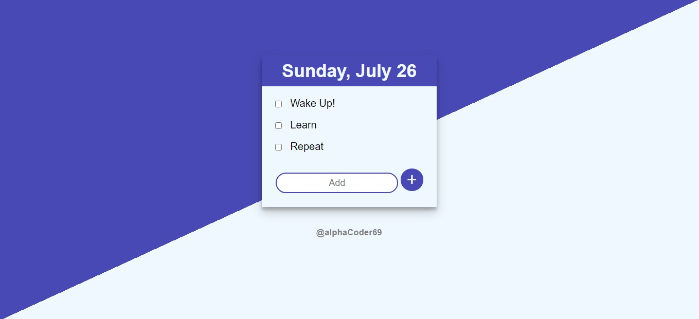
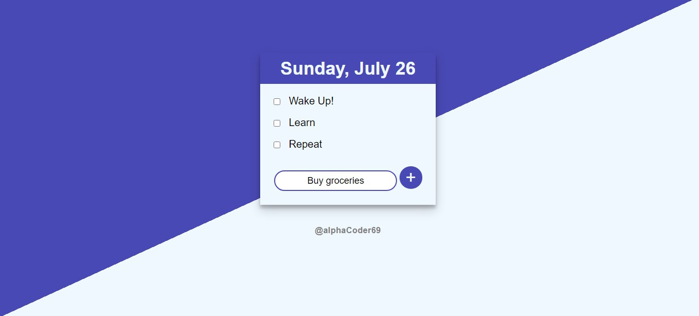
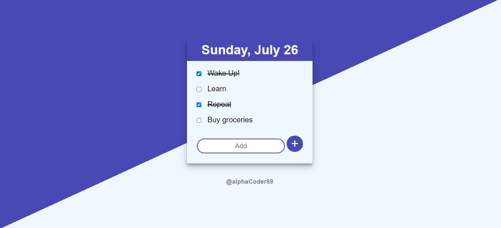

<h1>ToDo List</h1>

<h4>Do have a look at this <a href="https://protected-beach-83429.herokuapp.com/"> awesome app</a></h4>

This app can be a great use for reminding you the works you need to complete .Have problem in remembering ,then you are looking at the right site.Just list down your needs and there you are ,your nightmare of forgetting things gone forever as you can see it all in your screen.

* This is a fully functional ToDo List app made using 
    * NodeJs 
    * Express 
    * MongoDB Atlas
* Features:
    * Shows Present Day and Date
    * Auto-deletes to-dos once striked 
    * Stores the to-dos added and displays the same the next you come back to the site
    * Has a simple, nice and cool UI
    * You can add as many number of items as you want with no constraint, as the page is responsive and adds scroll effect as the list grows big!

